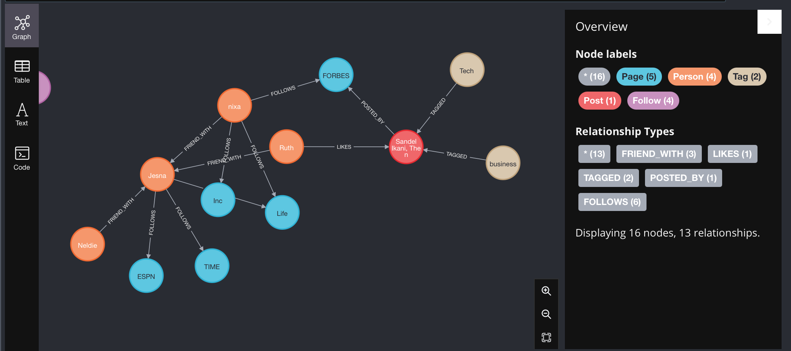

# social_network_spring_neo4j
A mini social network app built with neo4j (graph database) using spring boot, user can follow pages, send friend requests. 
Pages can post, posts will have tags, users can like posts. 
pages and friends will be recommended to users depending on their relationships.

